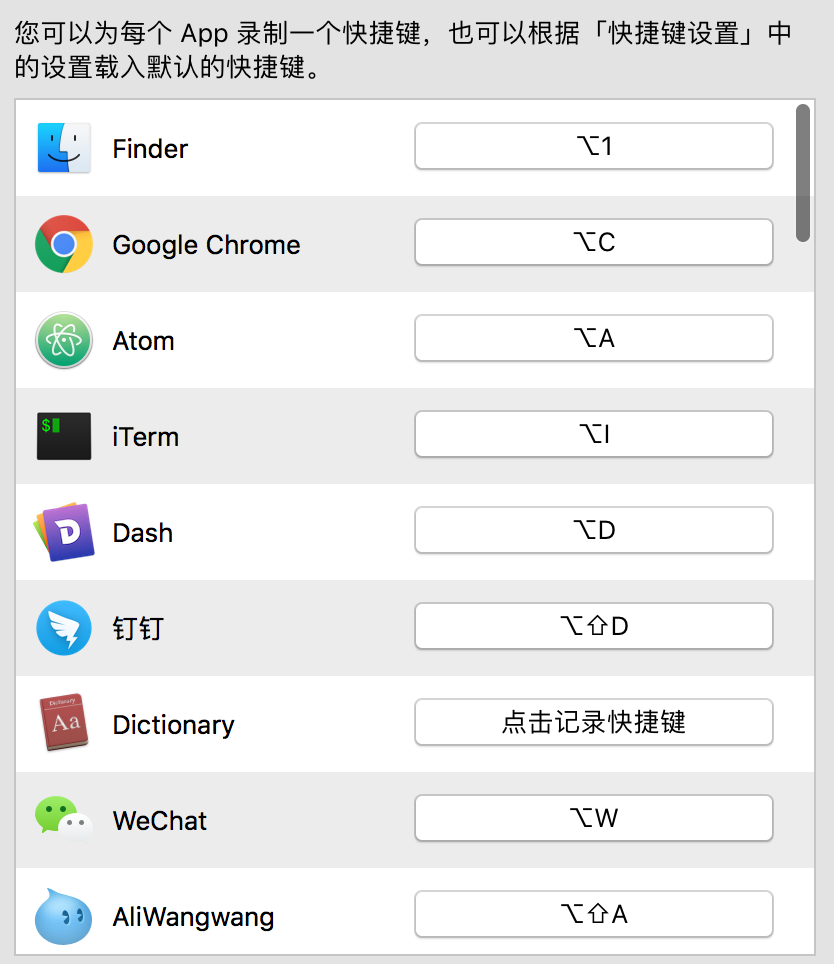
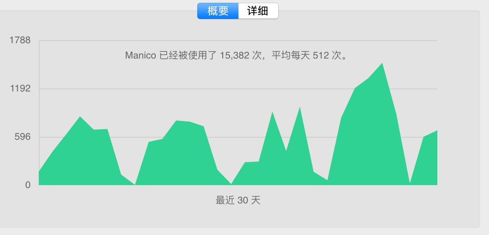
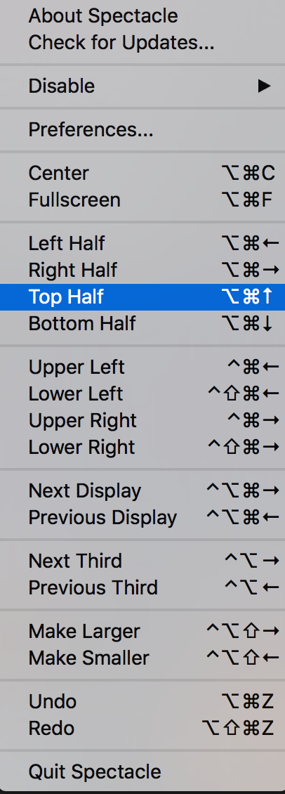
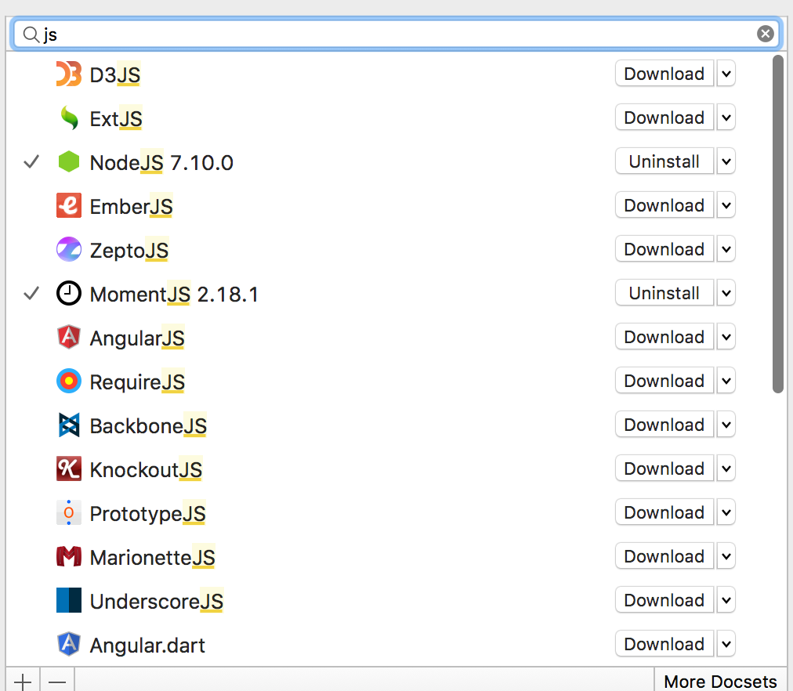
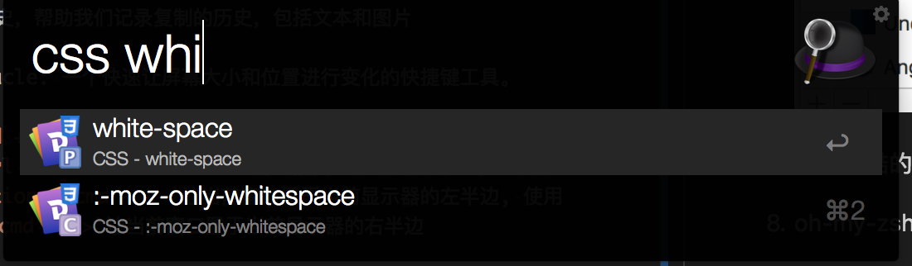
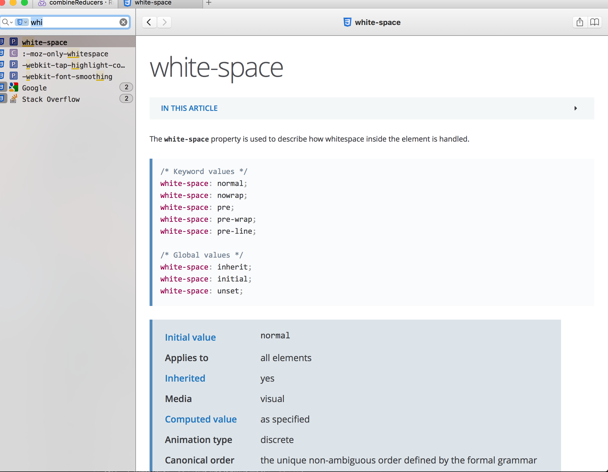
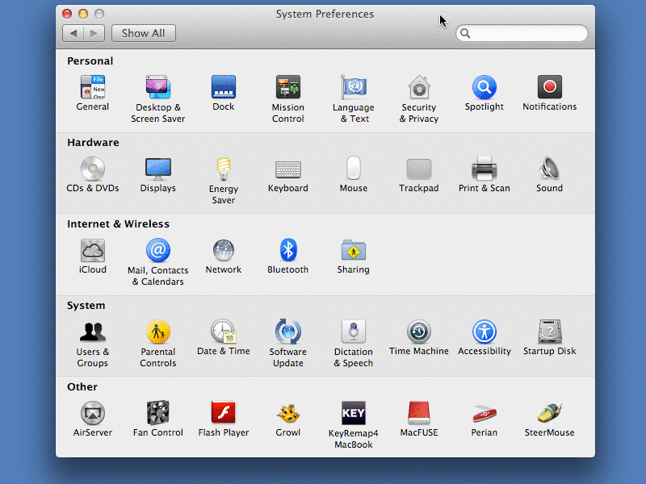

基础类:  
1. [免费]Chrome插件: vimium, 脱离鼠标，使用键盘操作chrome，[下载地址](https://chrome.google.com/webstore/detail/vimium/dbepggeogbaibhgnhhndojpepiihcmeb) 
    * 常用快捷键
        1. 使用`h`,`j`,`k`,`l`,`d`,`u`移动滚轮
        2. 使用`f`,`F`打开链接
        3. 使用`gt`,`gT`,`{n}gt`,`{n}gT`切换页卡, `g0`到第一个页卡, `g$`到最后一个页卡
        4. 使用`gi`找到输入框，然后输入内容
        5. 使用`x`关闭页卡, `X`重新打开之前关闭的页卡
        6. 使用`b`打开书签页
        7. 使用`gs`查看页面源码
        8. 更多精彩..
    * 弊端
        1. 新页卡下无法使用
        2. 焦点在开发者工具的时候无法使用(解决办法见[此问题](http://stackoverflow.com/questions/12823333/keyboard-shortcut-to-switch-focus-from-web-developer-tools-to-page-in-chrome-on))
2. [收费]manico: 快速切换应用的工具。工具[链接](https://itunes.apple.com/us/app/manico/id724472954?ls=1&mt=12)
    可以使用快捷键快速切换应用，比如可以使用`Option + c`打开chrome。如下是我的设置
    
    这是我每天的使用率, 每天要使用它切换应用500多次 :-)
    
3. [免费]autojump帮助快速跳到某一个文件夹, [安装地址](./2015-11-26-chang-yong-gong-ju-ji-he/manico-usage.pn)

    接下来要介绍一个我使用次数更加频繁的工具，autojump。有了他，我不用再一次次使用`cd`命令跳转文件夹，我可以非常轻松地切换任意我之前进入过的文件夹。
4. 非常好用的snippet保存和剪切板保存工具 [clipmenu](http://www.clipmenu.com/)。随时随地想要使用它的时候，它，就在你身边。它只包含了以下两个特性，不过使用起来非常顺滑流畅，随时唤起，使用方向键找到你想要粘贴的文本或者图片即可。

    1. snippets，用来保存一些常用的文本片段，可以是代码片段，账号之类
    2. 剪切板历史，帮助我们记录复制的历史，包括文本和图片

5. [免费]spectacle: 一个快速让屏幕大小和位置进行变化的快捷键工具。

    1. 使用`cmd + shift + f`进入全屏
    2. 使用`ctrl + cmd + shift + ->`将当前窗口移动到另外一个显示屏上
    3. 使用`option + cmd + <-`让当前窗口置于当前显示器的左半边, 使用`option + cmd + ->`让当前窗口置于当前显示器的右半边

    更多快捷键请看下图介绍

6. [高级功能收费]alfred: 快速打开程序和一些工作流的工具，spotlight有的功能基本有，他跟系统自带的spotlight比有如下优势

    1. 可以指定搜索的类别，比如想要搜索词典, 使用'dict '前缀, 然后输入想要搜索的词
    2. 集成系统命令 
    3. 可以自定义工作流
    4. 可以换肤:-)

7. [免费]dash: 离线文档查看工具，包含了比较全而且比较权威的文档，有官方提供的文档，还有第三方提供的，非常全，只有你想不到，没有你搜不到。

    

    其实最酷的是跟上面的alfred配合，如下图，可以快速搜索到你想要查看的一个词条
    

    

8. [免费]shortcut: 一个脱离鼠标，使用键盘操作所有mac下应用的工具。对于键盘党来说图形化的界面也能够使用键盘也是一件非常爽的事情。shortcat就是为这些人准备的。使用`cmd + shift + space`唤起一个输入框，然后输入你想点击的ui按钮文案，按回车就相当于鼠标点击啦。

    

其他我平时使用的:
1. oh-my-zsh & zsh 替换原生bash的一个终端
2. caffeine: 一个快速防止系统休眠的工具
3. terminal的替换工具: iterm
4. 轻云: 一个比较好用的翻墙工具(推荐跟别人一起买)
5. 轻量但好用的邮件客户端: foxmail
6. uc qr code: chrome插件，一个自动生成二维码的工具, 一般会生成当前页面的二维码，或者手动输入文本生成二维码
7. postman: 一个非常好用的模拟提交请求的工具

进阶类:  
1. tmux: 一个多终端复用工具
2. lastpass: 快速生成和保存账号密码的工具(浏览器插件)
3. sourcetree: 一个比较好用的git代码管理工具
4. feedly: chrome插件，用来订阅好的网站rss，配合[它的网站](http://www.feedly.com/)使用。
